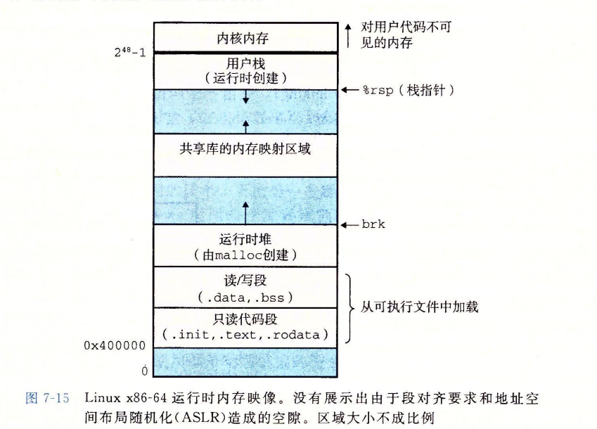

CSAPP读书笔记

# 程序运行

[Data_segment](https://en.wikipedia.org/wiki/Data_segment#Data)

.data: 拥有预定值的全局变量和静态变量，可修改

.bss:未初始化数据，包含初始化为0或者没有在代码中没有显式初始化的的全局变量或者静态变量

.init :定义了一个小函数，叫做_init,程序初始化代码会用到

.text：代码段，包含可执行指令，通常是只读并且固定大小的

.rodata: 全局范围	

# 异常控制流

异常控制流(Exceptional Control Flow, ECF)

> 异常控制流发生在计算机系统的各个层次。比如：
>
> - 在硬件层，硬件检测到的事件会触发到异常处理程序。
> - 在操作系统层，内核通过上下文切换将控制从一个用户进程转移到另一个用户进程。
> - 在应用层，一个进程可以发送信号到另一个进程，而接收者会将控制转移到它的一个信号处理程序。一个程序可以通过回避通常的栈规则，并执行到其他函数中任意位置的非本地跳转来对错误做出反应。

**ECF重要性**

- ECF是操作系统用来实现I/O、进程和虚拟内存的基本机制。
- 应用程序通过使用一种叫做陷入(trap)或者系统调用(system call)的ECF形式，向操作系统请求服务。
- ECF是计算机系统实现并发的基本机制。
- 在C++/Java的软件异常机制(try, catch, throw)中，允许程序通过非本地跳转来响应错误情况。非本地跳转（即违反通常的调用／返回栈的跳转）是一种应用层的ECF。在C中是通过setjmp和longjmp函数提供的。

## 异常

系统中可能的每种异常都分配了一个唯一的非负整数的异常号(exception number)，其中一些号码由处理器的设计者分配，其他号码由操作系统内核的设计者分配。前者包括**被零除、缺页、内存访问违例、断点**以及**算术运算溢出**。后者的示例包括**系统调用**和**来自外部I/O设备的信号**。

异常处理程序运行在**内核模式**下。

异常可以分为四类：中断(interrupt)、陷阱(trap)、故障(fault)和终止(abort)。

| 类别 | 原因              | 异步／同步 | 返回行为             |
| ---- | ----------------- | ---------- | -------------------- |
| 中断 | 来自I/O设备的信号 | 异步       | 总是返回到下一条指令 |
| 陷阱 | 有意的异常        | 同步       | 总是返回到下一条指令 |
| 故障 | 潜在可恢复的错误  | 同步       | 可能返回到当前指令   |
| 终止 | 不可恢复的错误    | 同步       | 不会返回             |

**中断**：异步发生的，来自处理器外部的I/O设备的信号的结果。不是由任何一条专门的指令造成的。

*剩下的异常类型是同步发生的，是执行当前指令的结果。这类指令叫做**故障指令**。*

**陷阱和系统调用**：在用户程序和内核之间提供**系统调用**（像调用过程一样），如读文件(read)、创建进程(fork)等。

**故障**：由错误情况引起，可能能够被修正。如，缺页异常。

**终止**：不可恢复的致命错误，通常为硬件错误。如DRAM或者SRAM被损坏。

## 进程

关键抽象：

- 一个独立的逻辑控制流，好像我们的程序独占CPU
- 一个私有的地址空间，好像我们的程序独占内存系统

内核通过上下文切换(context switch)的较高形式的异常控制流来实现多任务。

内核为每个进程维持一个上下文(context)。上下文就是内核重新启动一个被抢占的进程所需的状态。它由一些对象的值组成，这些对象包括通用目地寄存器、浮点寄存器、程序计数器、用户栈、状态寄存器、 内核栈和各种内核数据结构，比如描述地址空间的页表、包含有关当前进程信息的进程表，以及包含进程已打开的信息的文件表。

进程处于下面三种状态：

- **运行**。执行或者等待执行
- **停止**。被挂起且不会被调度。当收到SIGSTOP，SIGTSTP，SIGTTIN或者SIGTTOU
- **终止**。永运停止。原因：1）收到一个终止进程的信号，2）从主程序返回，3）调用exit函数

`_exit`：立马结束调用的进程，关闭所有打开的文件描述符，该进程的所有子进程会被`init(1)`收养。（或者是被最近的`subreaper`进程）。该进程的父进程会收到`SIGCHLD`信号。

## 信号

一个发出而没有被接收的信号叫做**待处理信号**(pending signal)。

pending位向量：维护待处理信号的集合。

blocked位向量（信号掩码）：维护着被阻塞的信号集合。