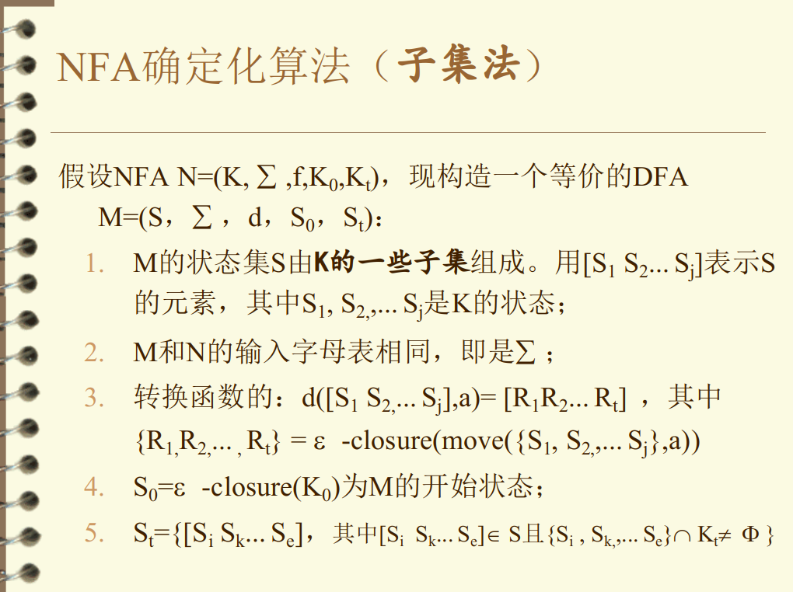
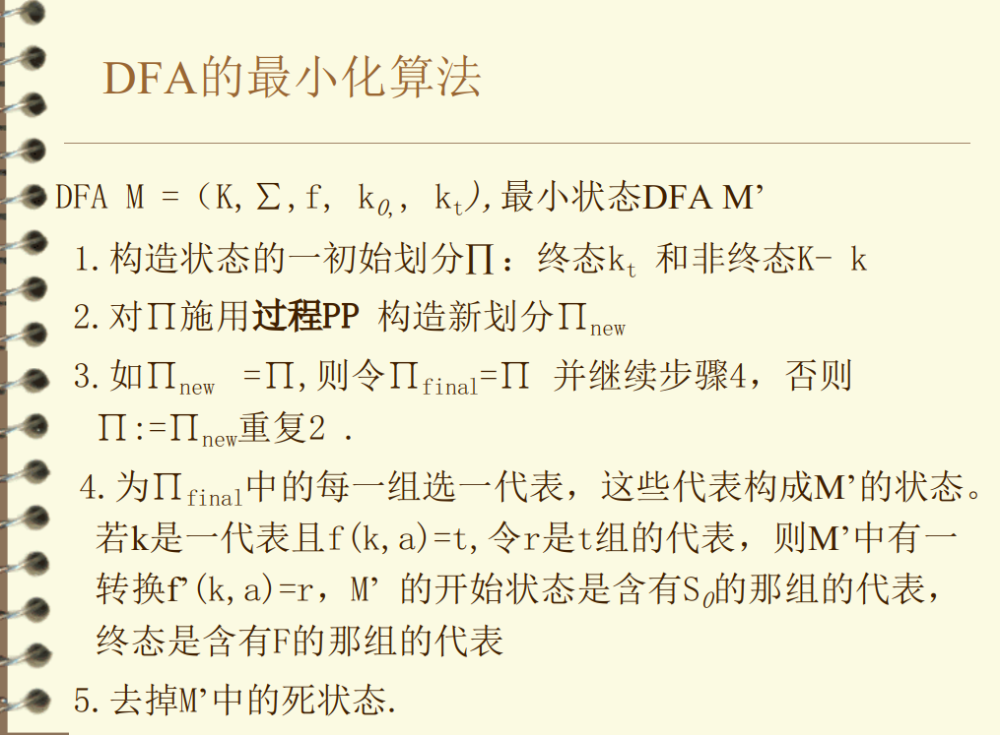
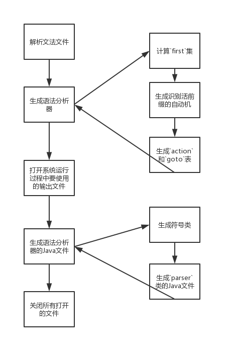
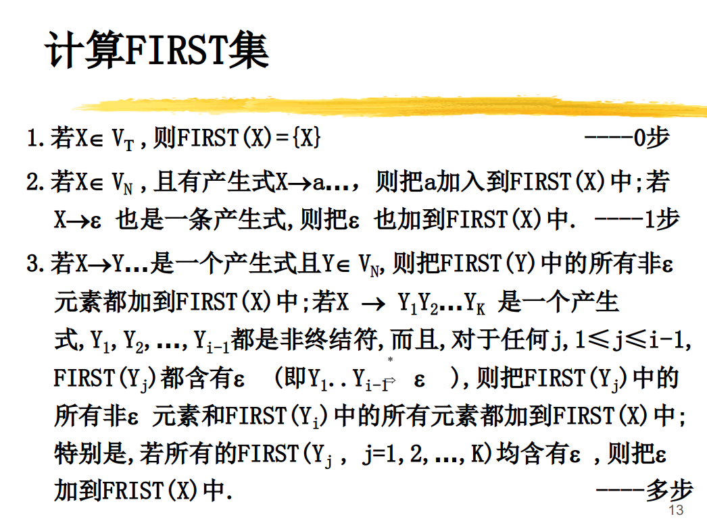
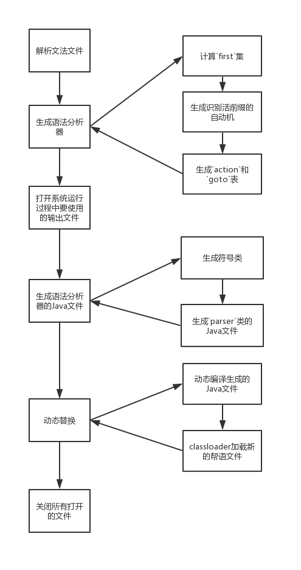

# 总体架构分析

# JFlex

JFlex主要负责根据用户的词法规则文件生成词法识别程序。

JFlex根据词法规则文件生成不确定的有穷自动机(NFA)，再通过子集法将NFA转为DFA，然后通过分割法将DFA最小化，最后以表驱动的形式来识别词汇。

## 词法规则文件

分为三部分，以`%%`号分隔:

> - 用户代码
> - 选项和声明
> - 词法规则文件

详见：[JFlex Specifications](https://www.jflex.de/manual.html#Specifications)

## 源码分析

`jflex.Main#main`运行时的入口类，负责解析参数以及调用真正的`generate`方法

`jflex.Main#generate` 真正的生成方法

- `java_cup.runtime.lr_parser#parse`生成识别词法的NFA文件
  
  - 从正规表达式构造等价的NFA(采用“语法制导”的方法)
- `jflex.NFA#getDFA`将NFA转为DFA
  
  - 子集法
  
    
- `jflex.DFA#minimize`将DFA最小化
  
  - 最小化的含义：没有多余状态；没有两个状态是互相等价。
  
  - 分割法
  
    

# CUP

CUP主要负责根据帮语的语法规则文件生成Java语言版的编译器。

## 语法规则文件

它的语法规则文件分为六部分：

- 包和import声明
- 解析器的类的名称
- 用户代码部分
- 符号（终结符和非终结符）列表
- 优先级声明
- 文法规则

详见：[Specification Syntax](http://www2.cs.tum.edu/projects/cup/docs.php#spec)

## 源码分析

`java_cup.Main#main` 为CUP运行的入口方法

`java_cup.Main#parse_grammar_spec`解析文法文件(`xx.cup`)

`java_cup.Main#build_parser`生成语法分析器

` java_cup.Main#open_files`打开系统运行过程中要使用的输出文件， `parser`文件和`symbol`文件

`java_cup.Main#emit_parser`生成语法分析器的Java文件

`java_cup.Main#close_files`关闭所有打开的文件

`java_cup.Main#build_parser`生成语法分析器

- `java_cup.non_terminal#compute_first_sets`计算`first`集

  

- `java_cup.lalr_state#build_machine`生成识别活前缀的自动机
  
  - 合并了同心集，见`java_cup.lalr_item_set`注释
  
  - 使用`Hashtable`实现集合
  
    项目集的构造.png)
  
- `java_cup.lalr_state#build_table_entries`生成`action`和`goto`表

`java_cup.Main#emit_parser`生成语法分析器的Java文件

- `java_cup.emit#symbols`生成符号类
- `java_cup.emit#parser`生成`parser`类的Java文件

## 生成的解析器

每一个生成的解析器包含三个生成的类。

`sym`类包含一系列的整形常量。

`parser`源文件包含两个类的定义

- 公开的`parser`类，实现真实的解析器,它是`java_cup.runtime.lr_parser`的子类，`lr_parser`类实现了LR解析器通用的表驱动的构架。`parser`在提供产生式(production)表、action表和goto表。
  
  - production 表
  
    为语法中的每个产生式提供左侧非终端的符号编号以及右侧的长度。
  
  - action 表
  
    表示在每个状态中遇到每个前瞻符号时要采取的操作（移位，归约或错误）
  
  - goto 表
  
    指示在归约之后转移到哪个状态
- 非公开的类`CUP$action`，封装用户在文法中定义的所有action，还有来自`action code`声明中的代码。除了用户提供的代码，这个类也包含一个方法`CUP$do_action`，在这个方法中包含了一个大的switch语句来选择和执行各种用户提供的代码段。通常，所有以`CUP$`前缀开始的命名都是保留给CUP生成代码内部使用的。

将分析栈与符号栈合二为一了。

# 改造方案

原因：现阶段的语义都是Java代码来表达的，所以每次扩展词汇和语法需要手动替换生成的编译器。

解决方法：使用`JavaCompiler `类，可以动态编译Java文件。

使用`JavaCompiler`后的流程图

与原来的流程相比，主要改动在于：使用`JavaCompiler`类自动编译生成的源代码形式的Java文件，动态进行替换。

参考：

1. [https://www.jflex.de/docu.html](https://www.jflex.de/docu.html)
2. [http://www2.cs.tum.edu/projects/cup/docs.php#intro](http://www2.cs.tum.edu/projects/cup/docs.php#intro)
3. [JavaCompiler ](https://docs.oracle.com/javase/7/docs/api/javax/tools/JavaCompiler.html)