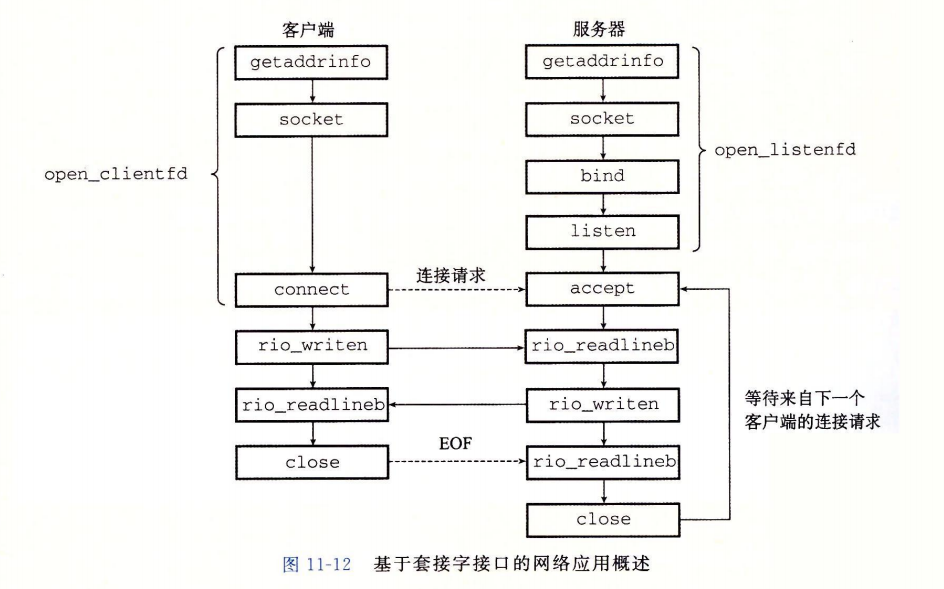

# 网络编程



```c
// IP address structure
struct in_addr {
    unit32_t s_addr; // Address in network byte order(big-endian)
}

// IP socket address structure
struct sockaddr_in {
    uint16_t       sin_family;  // Protocol family (always AF_INET)
    uint16_t       sin_port;    // Port number in network byte order
    struct in_addr sin_addr;    // IP address in network byte order
    unsigned char  sin_zero[8]; // Pad to sizeof(struct sockaddr)
}

// Generic socket address structure(for connect, bind, and accept)
struct sockaddr {
    uint16_t sa_family;    // Protocol family
    char     sa_data[14];  // Address data
}

```

***_in 后缀是互联网络(internet)的缩写***

`socket`函数 : 此函数返回的描述符仅是部分打开的，还不用于读写。

`connect`函数 : 客户端通过connect函数建立和服务器的连接。

服务器通过`bind`, `listen`, 和`accept`函数来建立与客户端的连接。

`bind`函数

`listen`函数

`accept`函数


getaddrinfo函数

```c
int getaddrinfo(const char *host, const char *service,
               const struct addrinfo *hints);
void freeaddrinfo(struct addrinfo *result);
const char *gai_strerror(int errocode);
```

`hints`是一个`addrinfo`结构，提供对`getaddrinfo`返回的套接字地址列表的更好控制。


# 并发编程

## 基于进程的并发服务器

## 基于I/O多路复用的并发编程

[select、poll、epoll之间的区别总结](https://www.cnblogs.com/Anker/p/3265058.html)

## select 

```c++
int select(int nfds, fd_set *readfds, fd_set *writefds,
	fd_set *exceptfds, struct timeval *timeout);

void FD_CLR(int fd, fd_set *set);
int  FD_ISSET(int fd, fd_set *set);
void FD_SET(int fd, fd_set *set);
void FD_ZERO(fd_set *set);
```

> select() can monitor only file descriptors numbers that are less than FD_SETSIZE; poll(2) does not have this limitation. 

## poll

## epoll

### 基于I/O多路复用的并发事件驱动服务器

## 基于线程的并发编程

### 基于线程的事件驱动编程


