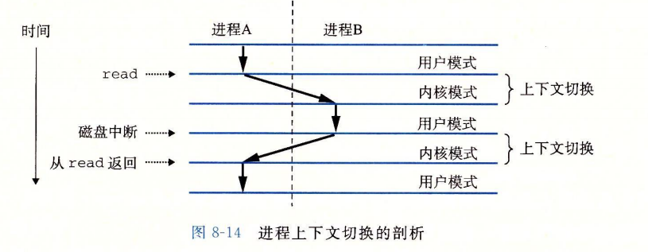
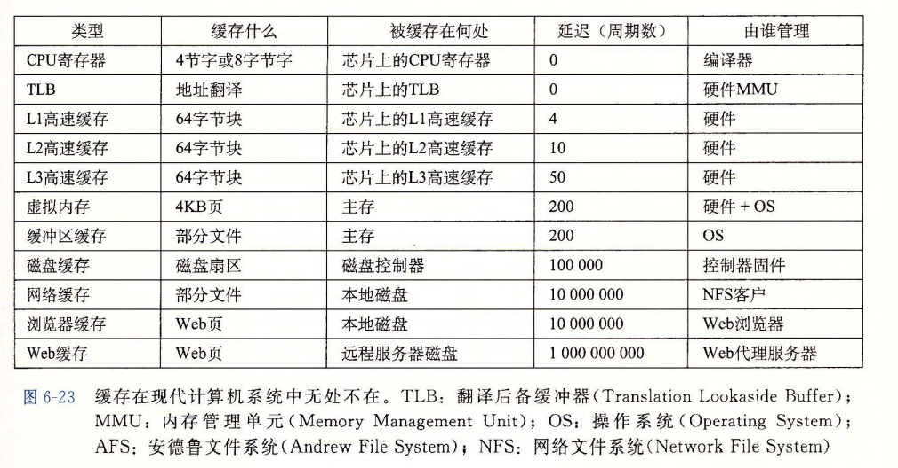
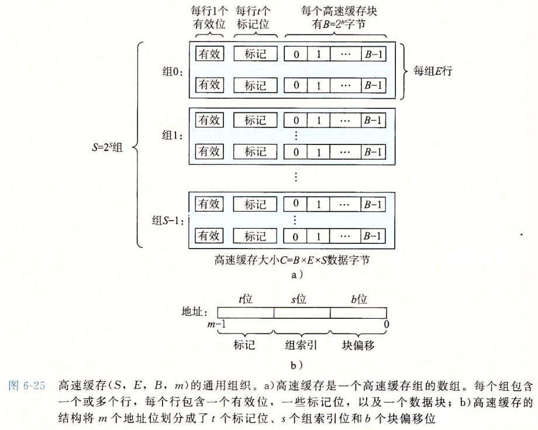

CSAPP读书笔记

# 程序运行


[Data_segment](https://en.wikipedia.org/wiki/Data_segment#Data)

.data: 拥有预定值的全局变量和静态变量，可修改

.bss:未初始化数据，包含初始化为0或者没有在代码中没有显式初始化的的全局变量或者静态变量


.init :定义了一个小函数，叫做_init,程序初始化代码会用到

.text：代码段，包含可执行指令，通常是只读并且固定大小的

.rodata: 全局范围	

# 异常控制流

异常控制流(Exceptional Control Flow, ECF)

> 异常控制流发生在计算机系统的各个层次。比如：
>
> - 在硬件层，硬件检测到的事件会触发到异常处理程序。
> - 在操作系统层，内核通过上下文切换将控制从一个用户进程转移到另一个用户进程。
> - 在应用层，一个进程可以发送信号到另一个进程，而接收者会将控制转移到它的一个信号处理程序。一个程序可以通过回避通常的栈规则，并执行到其他函数中任意位置的非本地跳转来对错误做出反应。

**ECF重要性**

- ECF是操作系统用来实现I/O、进程和虚拟内存的基本机制。
- 应用程序通过使用一种叫做陷入(trap)或者系统调用(system call)的ECF形式，向操作系统请求服务。
- ECF是计算机系统实现并发的基本机制。
- 在C++/Java的软件异常机制(try, catch, throw)中，允许程序通过非本地跳转来响应错误情况。非本地跳转（即违反通常的调用／返回栈的跳转）是一种应用层的ECF。在C中是通过setjmp和longjmp函数提供的。

## 异常

系统中可能的每种异常都分配了一个唯一的非负整数的异常号(exception number)，其中一些号码由处理器的设计者分配，其他号码由操作系统内核的设计者分配。前者包括**被零除、缺页、内存访问违例、断点**以及**算术运算溢出**。后者的示例包括**系统调用**和**来自外部I/O设备的信号**。

异常处理程序运行在**内核模式**下。

异常可以分为四类：中断(interrupt)、陷阱(trap)、故障(fault)和终止(abort)。

| 类别 | 原因              | 异步／同步 | 返回行为             |
| ---- | ----------------- | ---------- | -------------------- |
| 中断 | 来自I/O设备的信号 | 异步       | 总是返回到下一条指令 |
| 陷阱 | 有意的异常        | 同步       | 总是返回到下一条指令 |
| 故障 | 潜在可恢复的错误  | 同步       | 可能返回到当前指令   |
| 终止 | 不可恢复的错误    | 同步       | 不会返回             |

**中断**：异步发生的，来自处理器外部的I/O设备的信号的结果。不是由任何一条专门的指令造成的。

*剩下的异常类型是同步发生的，是执行当前指令的结果。这类指令叫做**故障指令**。*

**陷阱和系统调用**：在用户程序和内核之间提供**系统调用**（像调用过程一样），如读文件(read)、创建进程(fork)等。

**故障**：由错误情况引起，可能能够被修正。如，缺页异常。

**终止**：不可恢复的致命错误，通常为硬件错误。如DRAM或者SRAM被损坏。

## 进程

关键抽象：

- 一个独立的逻辑控制流，好像我们的程序独占CPU
- 一个私有的地址空间，好像我们的程序独占内存系统

内核通过上下文切换(context switch)的较高形式的异常控制流来实现多任务。

内核为每个进程维持一个上下文(context)。上下文就是内核重新启动一个被抢占的进程所需的状态。它由一些对象的值组成，这些对象包括通用目地寄存器、浮点寄存器、程序计数器、用户栈、状态寄存器、 内核栈和各种内核数据结构，比如描述地址空间的页表、包含有关当前进程信息的进程表，以及包含进程已打开的信息的文件表。



### 进程控制

进程处于下面三种状态：

- **运行**。执行或者等待执行
- **停止**。被挂起且不会被调度。当收到SIGSTOP，SIGTSTP，SIGTTIN或者SIGTTOU
- **终止**。永运停止。原因：1）收到一个终止进程的信号，2）从主程序返回，3）调用exit函数

```c++
void exit(int status); // 以status状态退出状态来终止进程
```

`_exit`：立马结束调用的进程，关闭所有打开的文件描述符，该进程的所有子进程会被`init(1)`收养。（或者是被最近的`subreaper`进程）。该进程的父进程会收到`SIGCHLD`信号。

```c++
pid_t fork(void); //创建一个新的运行的子进程
```
```c++
pid_t wait(int *wstatus); // waitpid(-1, &wstatus, 0);
pid_t waitpid(pid_t pid, int *wstatus, int options);
```

`wait`函数：等进程改变状态，如果当前进程没有子进程返回－1，并设置errno

改变状态为以下三种：子进程终止（默认），子进程由于收到信号停止和子进程收到信号继续执行


> **pid**
>
> - pid > 0, 等待一个单独的子进程
> - pid = -1, 等待所有子进程
>
> **options**
>
> - WNOHANG：立马返回如果没有子进程退出
> - WUNTRACED：如果子进程stopped也返回 （默认情况下只当子进程终止的时候返回）
> - WCONTINUED：如果停止的子进程由于收到`SIGCONT`信号继续执行也会返回
>
> **wstatus**

```c++
unsigned int sleep(unsigned int seconds); // 让一个进程挂起一段指定的时间
```

```c++
int pause(void); // 让进程休眠直到进程收到一个信号
```

```c++
int execve(const char *filename, char *const argv[],
                  char *const envp[]); // 在当前进程的上下文加载并运行一个新的程序
```


### Linux下进程状态

- R（TASK_RUNNING）
- S（TASK_INTERRUPTIBLE）
- D（TASK_UNINTERUPTIBLE）
- T（TASK_STOPPED or TASK_TRACED）
- Z（TASK_DEAD - EXIT_ZOMBIE）

处于TASK_STOPPED状态（收到SIGSTOP、SIGTSTP等信号）的进程不会响应SIGTERM，但是会响应SIGKILL

> **While a process is stopped, no more signals can be delivered to it until it is continued, except `SIGKILL` signals and (obviously) `SIGCONT` signals**. The signals are marked as pending, but not delivered until the process is continued. **The `SIGKILL` signal always causes termination of the process and can’t be blocked, handled or ignored**. You can ignore `SIGCONT`, but it always causes the process to be continued anyway if it is stopped. Sending a `SIGCONT` signal to a process causes any pending stop signals for that process to be discarded. Likewise, any pending `SIGCONT` signals for a process are discarded when it receives a stop signal.
>
> When a process in an orphaned process group (see [Orphaned Process Groups](https://www.gnu.org/software/libc/manual/html_node/Orphaned-Process-Groups.html#Orphaned-Process-Groups)) receives a `SIGTSTP`, `SIGTTIN`, or `SIGTTOU` signal and does not handle it, the process does not stop. Stopping the process would probably not be very useful, since there is no shell program that will notice it stop and allow the user to continue it. What happens instead depends on the operating system you are using. Some systems may do nothing; others may deliver another signal instead, such as `SIGKILL` or `SIGHUP`. On GNU/Hurd systems, the process dies with `SIGKILL`; this avoids the problem of many stopped, orphaned processes lying around the system.

[Job-Control-Signals](https://www.gnu.org/software/libc/manual/html_node/Job-Control-Signals.html)

### 进程IPC

管道、先进先出（FIFO）、系统共享内存以及系统信号量（semaphore）

### 与线程的区别

> Linux使用1－1的线程模型，对于内核来说并不区分进程和线程，这些仅仅是可执行任务。
>
> 在Linux上，可以通过系统调用`clone`以不同共享级别复制任务
>
> - `CLONE_FILES`：共享相同的文件描述符表。（而不是创建一份复制）
> - `CLONE_PARENT`：不在新旧任务之间创立父子关系。（否则：child's `getppid()`==parent's`getpid()`）
> - `CLONE_VM`：共享相同的内存空间（(而不是创建一个 [COW](https://en.wikipedia.org/wiki/Copy-on-write) 的副本）
> - ...
>
> `fork()` calls `clone`(least sharing) and `pthread_create()` calls `clone(`most sharing)

[threads-vs-processes-in-linux](https://stackoverflow.com/questions/807506/threads-vs-processes-in-linux)

## 信号

Linux信号：软件形式的异常，允许进程和内核中断其他进程。


一个发出而没有被接收的信号叫做**待处理信号**(pending signal)。

pending位向量：维护待处理信号的集合。

blocked位向量（信号掩码）：维护着被阻塞的信号集合。

### 发送信号

- /bin/kill
- Ctrl + C: `SIGINT`; Ctrl + Z :`SIGTSTP`
- `int kill(pid_t pid, int sig);`
- ` unsigned int alarm(unsigned int seconds);`

### **接收信号**

当内核把进程p从内核模式切换到用户模式（例如：从系统调用返回或者是完成了一次上下文切换）时，它会检查进程p的未被处理的信号的集合。（pending &~blocked）

```c++
typedef void (*sighandler_t)(int);
sighandler_t signal(int signum, sighandler_t handler);
```

**SIGSTOP**和**SIGKILL**的默认行为不能修改的。

### 信号处理

安全的信号处理

1. 只调用异步信号安全的函数
2. 保存和恢复errno
3. 阻塞所有信号，保护对共享数据结构的访问
4. 使用volatile声明全局变量

正解的信号处理：**未处理的信号不排队**


软中断

硬件中断

同时收到两个信号，如:SIGSTOP, SIGTSTP

linux进程状态  可中断 nice

# 存储器层次结构

## 缓存不命中的种类

SRAM高速缓存存储器


一个空的缓存被称为冷缓存(cold cache)。

强制不命中(compulsory miss)或冷不命中(cold miss)

冲突不命中(conflict miss)：缓存足够大，但是由于这些对象会映射到同一个缓存块中，缓存会一直不命中。

容量不命中(capacity miss)：工作集的大小超过了缓存的大小。




L1 高速缓存：4个时钟周期

L2 高速缓存：10个周期

L3 高速缓存：50个周期

## 高速缓存存储器



高速缓存的结构可以用元组（S，E，B，m）来描述。

S表示：高速缓存组(cache set)

E表示：高速缓存行(cache line)

B表示：数据块(block)

高速缓存的大小（容量）C指的是所有块的大小的和。不含标记位和有效位。所以，C＝S * E * B。


### 直接映射高速缓存(direct-mapped cache)

E=1

### 组相联高速缓存(set associative cache)

一个1<E<C/B的高速缓存通常被称为E路组相联高速缓存。

> 组相联高速缓存中不命中时的行替换
>
> 有空行时替换空行
>
> 无空行
>
> - 随机选择要替换的行
> - 最不常使用(Least-Frequently-Used, LFU)
> - 最近最少使用(Least-Recently-Used, LRU)

### 全相联高速缓存(fully associative cache)

一个包含所有高速缓存行的组，即E = C / B。

### 关于写

写命中

> 直写(write-through)：立即将w的高速缓存块写回到紧接着的低一层。缺点：每次都会引起总线流量。
>
> 写回(write-back)：尽可能推迟更新，只有当替换算法要驱逐这个更新过的块的时候，才将它写回到紧接着的低一层。缺点：增加复杂性，需要维护一个额外的修改位。(dirty bit)

写不命中：

> 写分配(write-allocate)：加载低一层的块到高速缓存，然后更新缓存。
>
> 非写分配(not-write-allocate)：直接将字写到低一层中。

## 示例i7

i-cache只保存指令的高速缓存

d-cache只保存程序数据的高速缓存

统一的高速缓存(unified cache)，既保存指令又保存数据

优化高速缓存大小性能：高速缓存大小的影响、块大小的影响、相联度的影响、写策略的影响。（见书籍：6.4.6）

# 缓存友好的代码

示例：矩阵乘法