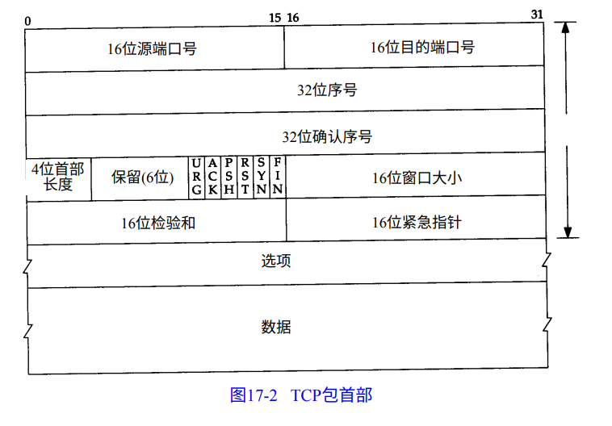

# 计算机网络

TCP提供**面向连接**的、**可靠**的**字节流**服务。

**可靠性**保证：

- 应用数据被TCP分割成最适合发送的数据块。（UDP不分块）
- TCP发出一个段后，它启动一个定时器，如果不能及时收到确认，将重发这个报文段。（自定义的超时及重传）
- TCP收到来自另一端的数据将推迟几分之一秒，发送一个确认。
- TCP会对收到的数据进行重新排序，将收到的数据以正确的顺序交给应用层。
- 流量控制。只允许另一端发送接收端缓冲区所接纳的数据。



**序号**：32位无符号数，表示在这个报文段中第一个数据字节，到达2^32-1后双从0开始。（**SYN**与**FIN**均消耗序号）

**首部长度**：单位为32位即4字节，取值是0－15，所以TCP最多有60字节的首部，正常的长度是20字节。

**窗口大小**：单位为字节数。

**检验和**：覆盖整个TCP报文段：TCP首部和TCP数据。（与UDP类似，需加伪首部）

**紧急指针**：正的偏移量，和序号字段中的值相加表示紧急数据最后一个字节的序号。

**可选字段**：

- 最长报文大小，MSS。

数据部分是可选的。

# TCP

发送的是字节流。

### 超时与重传

对于第个连接TCP管理4个不同的定时器：

- 重传定时器
- 坚持(persist)定时器
- 保活(keepalive)定时器
- 2MSL定时器

## 分片

IP层根据MTU对数据进行分片，在发送端分片，接收端合并。一个被IP层分片的TCP报文中只要有一个分片丢失了，整个TCP报文都得发。

UDP不分片

TCP分片

### MSS选项

MSS(Maximum Segment Size)最大报文长度

通常以太网上为1460

### 2MSL

MSL报文段最大生存时间

Linux 4.15 实现为 60s

**在2MSL等待期间，本地端口默认不能再被使用，部分系统中设置`SO_REUSEADDR`可重用**

客户端主动关闭会进入**TIME_WAIT**

### 叫入连接请求队列

应用层指明该队列的最大长度


经受时延的确认

TCP收到数据的时候不立即发关ACK，相返，它推迟发送，以便ACK与需要沿该方向的数据一起发送。（数据捎带ACK）

### RTT

Round-Trip Time 往返时间


### 不同进程监听不同网卡的同一端口（同一端口不同协议、同一协议不同网卡）

```
# tcp
nc -l 8888
nc -l -s 127.0.0.1 -p8888

#udp
nc -lu 8888
nc -lu -s 127.0.0.1 -p8888
```

**注意Linux 3.9之后，增加了`SO_REUSEPORT`，（具体可man 7 socket）多个进程可以监听同一网卡同一协议的同一端口**