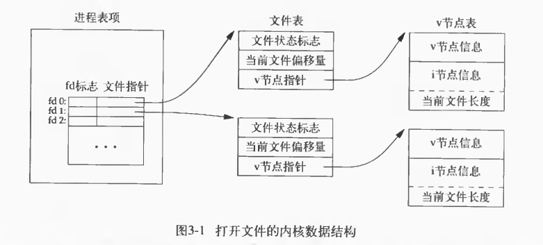

# UNP(unix network programming)

## Signal（信号）

| Signal  | Value | Action | Comment     |
| ------- | ----- | ------ | ----------- |
| SIGKILL | 9     | Term   | Kill signal |
| SIGTERM | 15    | Term   | Termination |

`SIGTERM`可以被捕获或者忽略，`SIGKILL`无法或者忽略。

```c++
#include <iostream>
#include <signal.h>
#include <unistd.h>

static void sig_hander(int);

int main() {
    if (signal(SIGUSR1, sig_hander) == SIG_ERR) {
        perror("can't catch siguser1");
    }
//    else if (signal(SIGTERM, sig_hander) == SIG_ERR) {
//        perror("can't catch SIGTERM");
//    }

    for (;;) {
        pause();
    }
    return 0;
}

static void sig_hander(int signo) {
    if (signo == SIGUSR1) {
        printf("received SIGUSER1\n");
    } else if (signo == SIGUSR2) {
        printf("received SIGUSER2\n");
    } else if (signo == SIGTERM) {
        printf("received SIGTERM\n");
    } else {
        printf("received signal %d\n", signo);
    }
}
```

## 文件共享



